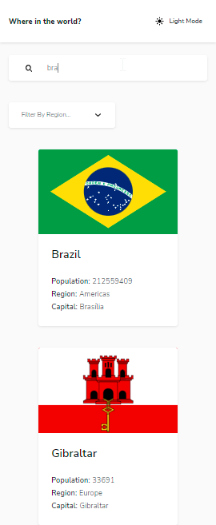

# Angular - Frontend Mentor - REST Countries API with color theme switcher solution

This is a solution to the [REST Countries API with color theme switcher challenge on Frontend Mentor](https://www.frontendmentor.io/challenges/rest-countries-api-with-color-theme-switcher-5cacc469fec04111f7b848ca). Frontend Mentor challenges help you improve your coding skills by building realistic projects.

## Table of contents

- [The Challenge](#the-challenge)
- [Screenshot](#screenshot)
  - [Desktop](#desktop)
  - [Mobile](#mobile)
- [Links](#links)
- [Built with](#built-with)
- [Continued development](#continued-development)
- [Author](#author)
- [Run Project](#run-project)

## The challenge

Users should be able to:

- See all countries from the API on the homepage
- Search for a country using an `input` field
- Filter countries by region
- Click on a country to see more detailed information on a separate page
- Click through to the border countries on the detail page
- Toggle the color scheme between light and dark mode

## Screenshots

### Desktop

### Mobile

## Built with

- [Angular](https://angular.io/) - JS Framework
- Semantic HTML5 markup
- CSS custom properties and variables
- Flexbox
- CSS Grid
- Mobile-first workflow
- [Ionic Icons](https://ionic.io/ionicons)

## Continued development

- Create an icon component;
- Render svg directly with Angular Sanitizer;
- Angular Animations

## Author

- Website - [fabiomonari.com](https://fabiomonari.com)
- Github Profile - [@fabiomonari](https://github.com/fabiomonari)
- Frontend Mentor - [@fabiomonari](https://www.frontendmentor.io/profile/fabiomonari)

## Run Project

- This project was generated with [Angular CLI](https://github.com/angular/angular-cli) version 13.2.4.
- Run `ng serve` for a dev server. Navigate to `http://localhost:4200/`. The app will automatically reload if you change any of the source files.
